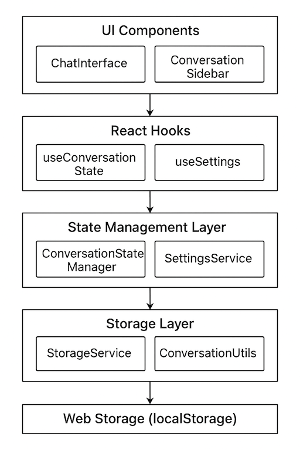

# PolyGlot - AI Chat Interface

A modern, elegant AI chat interface built with React, TypeScript, and Tailwind CSS. Connect to multiple AI providers (OpenAI, Anthropic, Google) with a beautiful glass-morphism design.

[](https://reactjs.org/)
[](https://www.typescriptlang.org/)
[](https://vitejs.dev/)
[](https://tailwindcss.com/)


## Features

- **Multi-Provider Support**: Connect to OpenAI, Anthropic, Google AI services, and Ollama (local)
- **Conversation Persistence**: Complete conversation management with automatic saving and history
- **Beautiful UI**: Glass-morphism design with smooth animations and modern aesthetics
- **API Key Management**: Securely store and manage multiple API keys per provider
- **Local AI Support**: Run AI models locally with Ollama (no API keys required)
- **Model Selection**: Choose from various AI models for each provider
- **Model Switching**: Switch AI models mid-conversation with full context preservation
- **Real-time Chat**: Smooth message flow with typing indicators
- **Responsive Design**: Works seamlessly on desktop and mobile devices
- **Dark Mode**: Elegant dark theme optimized for extended use
- **Toast Notifications**: User-friendly feedback for actions and errors
- **Testing**: Comprehensive test suite with Vitest and React Testing Library

## Conversation Persistence

PolyGlot now includes a **complete conversation management system** that keeps your AI chat history safe and organized:

### Key Features

- **Automatic Persistence**: Every conversation is automatically saved to your browser
- **Conversation History**: Browse and search through all your past conversations
- **Model Switching**: Switch AI models mid-conversation with full context preservation
- **Archive System**: Archive old conversations to keep your sidebar organized
- **Smart Search**: Find conversations by title, content, or model used
- **Real-time Sync**: Changes sync instantly across all components
- **Cross-Session**: Your conversations persist even after closing the browser

### Use Cases

- **Research & Learning**: Keep track of AI-assisted research across multiple sessions
- **Code Development**: Maintain context while iterating on coding problems
- **Content Creation**: Build upon previous AI conversations for long-term projects
- **Model Comparison**: Easily compare responses from different AI models
- **Knowledge Management**: Organize and retrieve AI-generated insights

### Getting Started

1. **Start a conversation** - Your first message automatically creates a new conversation
2. **Switch models** - Click on model badges in the chat header to switch AI models
3. **Manage history** - Use the sidebar to browse, search, and organize conversations
4. **Archive conversations** - Right-click on conversations to archive or delete them

## Quick Start

### Prerequisites

- Node.js 18+ 
- npm or yarn (bun support coming soon)

### Installation

1. **Clone the repository**
   ```bash
   git clone https://github.com/yourusername/polyglot.git
   cd polyglot
   ```

2. **Install dependencies**
   ```bash
   npm install
   ```

3. **Set up environment variables** (optional for development)
   ```bash
   cp .env.example .env.local
   # Edit .env.local with your API keys if testing real integrations
   ```

4. **Start the development server**
   ```bash
   npm run dev
   ```

5. **Open your browser**
   Navigate to `http://localhost:8080`

## Configuration

### Setting Up AI Providers

#### Cloud Providers (OpenAI, Anthropic, Google)
1. **Open Settings**: Click the settings icon (⚙️) in the top-right corner
2. **Select Provider**: Choose from OpenAI, Anthropic, or Google
3. **Add API Key**: Click "Add Key" and enter your API credentials
4. **Choose Model**: Select the AI model you want to use
5. **Start Chatting**: Begin your conversation!

#### Local Provider (Ollama)
1. **Install Ollama**: Follow the [official installation guide](https://ollama.ai/download)
2. **Pull Models**: Download the models you want to use:
   ```bash
   ollama pull llama3.2
   ollama pull mistral
   ollama pull codellama
   ```
3. **Start Ollama**: Ensure Ollama is running (it starts automatically on most systems)
4. **Configure in App**: 
   - Open Settings and select "Ollama (Local)"
   - Verify the base URL (default: http://localhost:11434)
   - Select your preferred model
5. **Start Chatting**: Begin your conversation with local AI models!

### Supported Providers & Models

| Provider | Models | Type |
|----------|--------|------|
| **OpenAI** | GPT-4.1, GPT-4o, GPT-4o-mini | Cloud |
| **Anthropic** | Claude Sonnet 4, Claude Opus 4, Claude 3.5 Haiku | Cloud |
| **Google** | Gemini Pro, Gemini Pro Vision | Cloud |
| **Ollama** | Llama 3.2, Mistral, CodeLlama, Phi-3 | Local |

## Development

### Project Structure

The project follows a clean, layered architecture that separates concerns and provides a maintainable codebase. See the [System Architecture](#system-architecture) section below for a detailed visual representation of how components interact.

```
src/
├── components/
│   ├── ChatInterface.tsx    # Main chat component
│   ├── SettingsPanel.tsx    # Settings management
│   ├── ConversationSidebar.tsx # Conversation management UI
│   ├── OllamaStatus.tsx     # Ollama connection status
│   └── ui/                  # Shadcn/ui components
├── pages/
│   ├── Index.tsx           # Main page
│   └── NotFound.tsx        # 404 page
├── hooks/
│   ├── use-mobile.tsx      # Mobile detection hook
│   ├── use-toast.ts        # Toast notifications
│   ├── useConversationState.ts # Conversation state management
│   └── useSettings.ts      # Settings management
├── services/
│   ├── api.ts              # Multi-provider API service
│   ├── ollama.ts           # Ollama integration
│   ├── storage.ts          # Data persistence layer
│   ├── conversationUtils.ts # Conversation utilities
│   ├── settingsService.ts  # Settings management
│   └── conversationStateManager.ts # Centralized state management
├── types/
│   └── conversation.ts      # Type definitions
├── lib/
│   └── utils.ts            # Utility functions
├── __tests__/              # Test files
│   ├── hooks/              # Hook tests
│   ├── components/         # Component tests
│   └── services/           # Service tests
└── App.tsx                 # Root component
```

### System Architecture

PolyGlot follows a clean, layered architecture that separates concerns and provides a maintainable codebase:



The architecture diagram above shows how the different layers interact:
- **UI Components**: User interface components for chat and conversation management
- **React Hooks**: Custom hooks that provide easy access to state and operations
- **State Management**: Centralized state management with observer pattern
- **Storage Layer**: Data persistence and utility functions
- **Web Storage**: Client-side storage using localStorage

### Key Architectural Features

- **Separation of Concerns**: Each layer has a specific responsibility
- **Observer Pattern**: Real-time state synchronization across components
- **Type Safety**: Full TypeScript integration with proper interfaces
- **Error Boundaries**: Comprehensive error handling and user feedback
- **Performance**: Optimized re-renders and background operations
- **Scalability**: Easy to extend with new providers and features

### Available Scripts

```bash
# Development
npm run dev          # Start development server
npm run build        # Build for production
npm run build:dev    # Build for development
npm run preview      # Preview production build

# Testing
npm run test         # Run tests in watch mode
npm run test:ui      # Run tests with UI
npm run test:run     # Run tests once
npm run coverage     # Generate coverage report

# Code Quality
npm run lint         # Run ESLint
npm run type-check   # TypeScript type checking
```

### Tech Stack

- **Frontend**: React 18.3.1, TypeScript 5.5.3
- **Build Tool**: Vite 5.4.1
- **Styling**: Tailwind CSS 3.4.11
- **UI Components**: Shadcn/ui with Radix UI
- **State Management**: Custom centralized state management with observer pattern
- **Data Persistence**: Web Storage (localStorage) with automatic validation
- **Icons**: Lucide React
- **Animations**: CSS animations with Tailwind
- **Testing**: Vitest, React Testing Library, MSW

## Testing

The project includes a comprehensive test suite:

- **Unit Tests**: Component and hook testing with React Testing Library
- **Mock Service Worker**: API mocking for consistent test results
- **Test Utilities**: Custom render functions and test helpers
- **Coverage**: Code coverage reporting with Vitest

Run tests with:
```bash
npm run test        # Watch mode
npm run test:run    # Single run
npm run coverage    # Coverage report
```

## Design System

### Color Palette
- **Primary**: Purple gradient (`hsl(263 70% 50%)`)
- **Background**: Dark gradient with glass effect
- **Chat Bubbles**: User messages in purple, AI responses in muted gray
- **Glass Effect**: Backdrop blur with semi-transparent backgrounds

### Key Design Features
- **Glass-morphism**: Semi-transparent panels with backdrop blur
- **Smooth Animations**: Message slide-in and typing indicators
- **Responsive Layout**: Adapts to different screen sizes
- **Accessibility**: Proper ARIA labels and keyboard navigation

## Security

- API keys are stored locally in browser memory (not persisted)
- No server-side storage of sensitive data
- Secure input handling and validation
- Masked API key display in settings

## Current Status

**✅ Feature Complete**: PolyGlut now includes a fully functional conversation persistence system!

### What's Working

- **Multi-Provider AI Integration**: Full support for OpenAI, Anthropic, Google AI, and Ollama
- **Conversation Management**: Complete conversation history with persistence across sessions
- **Model Switching**: Seamless model switching mid-conversation with context preservation
- **Real-time Chat**: Smooth message flow with typing indicators and response timing
- **Settings Persistence**: User preferences and API keys saved across sessions
- **Responsive Design**: Beautiful glass-morphism UI that works on all devices

### Conversation Persistence Features

- **Automatic Saving**: Conversations are saved automatically after each message
- **Conversation History**: Browse, search, and filter your conversation history
- **Archive System**: Archive old conversations to keep your sidebar clean
- **Model Tracking**: See which models were used in each conversation
- **Context Preservation**: Switch between conversations with full message history
- **Export/Import**: Backup and restore your conversations (coming soon)

### Technical Implementation

The conversation persistence system is built with:
- **Web Storage**: Uses localStorage for efficient client-side persistence
- **State Management**: Centralized state management with real-time synchronization
- **Type Safety**: Full TypeScript integration with comprehensive interfaces
- **Error Handling**: Robust error boundaries and user feedback
- **Performance**: Optimized rendering and background operations

### Next Steps

While the core feature is complete, future enhancements may include:
- Database migration for production deployments
- Cloud sync capabilities
- Conversation sharing features
- Desktop application version
- Advanced analytics and insights

## Deployment

### Build for Production

```bash
npm run build
```

The built files will be in the `dist/` directory, ready for deployment to any static hosting service like:
- Vercel
- Netlify
- GitHub Pages
- AWS S3 + CloudFront

### Environment Variables

For production deployment, you may need to set environment variables:
- `VITE_APP_TITLE`: Application title
- `VITE_APP_DESCRIPTION`: Application description

## Contributing

1. Fork the repository
2. Create a feature branch (`git checkout -b feature/amazing-feature`)
3. Commit your changes (`git commit -m 'Add amazing feature'`)
4. Push to the branch (`git push origin feature/amazing-feature`)
5. Open a Pull Request

### Development Guidelines

- Follow the existing code style and TypeScript patterns
- Add tests for new features
- Ensure all tests pass before submitting PRs
- Update documentation as needed

## License

This project is licensed under the MIT License - see the [LICENSE](LICENSE) file for details.

## Acknowledgments

- [Shadcn/ui](https://ui.shadcn.com/) for the beautiful component library
- [Radix UI](https://www.radix-ui.com/) for accessible primitives
- [Tailwind CSS](https://tailwindcss.com/) for the utility-first styling
- [Lucide](https://lucide.dev/) for the beautiful icons
- [Vitest](https://vitest.dev/) for the fast testing framework

